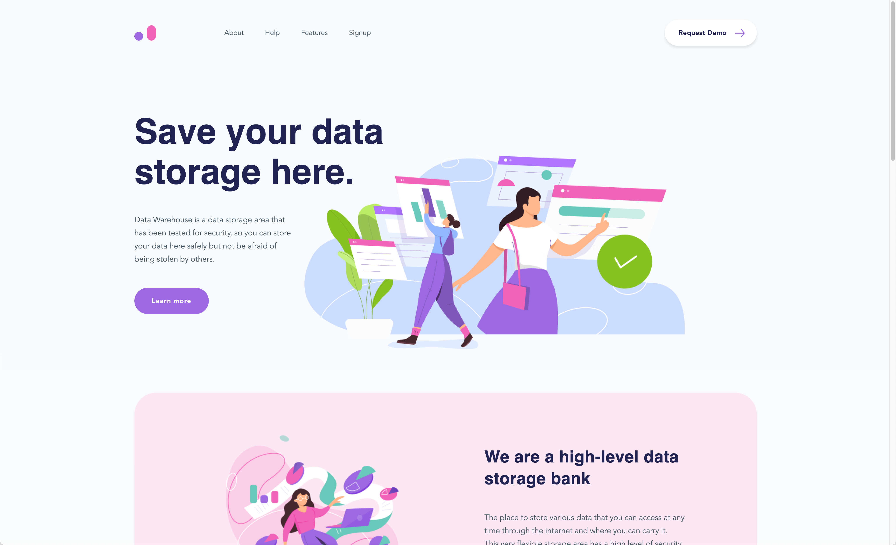

## ClickUp Figma

This is a mini project for [ClickUp](https://clickup.com/about).

I have turned [this figma design](https://www.figma.com/file/qNLG2DvzowucTvhyYoM6KB/HTML-and-CSS-Engineer-Mini-Project) into a fully responsive web page down to a 320px viewport width (iPhone 5), while only using vanilla HTML / CSS.

## Viewing the Web Page

To view the page, clone the repo, and:

Option 1: Open the file with live server

or

Option 2: Open the index.html file in your browser
